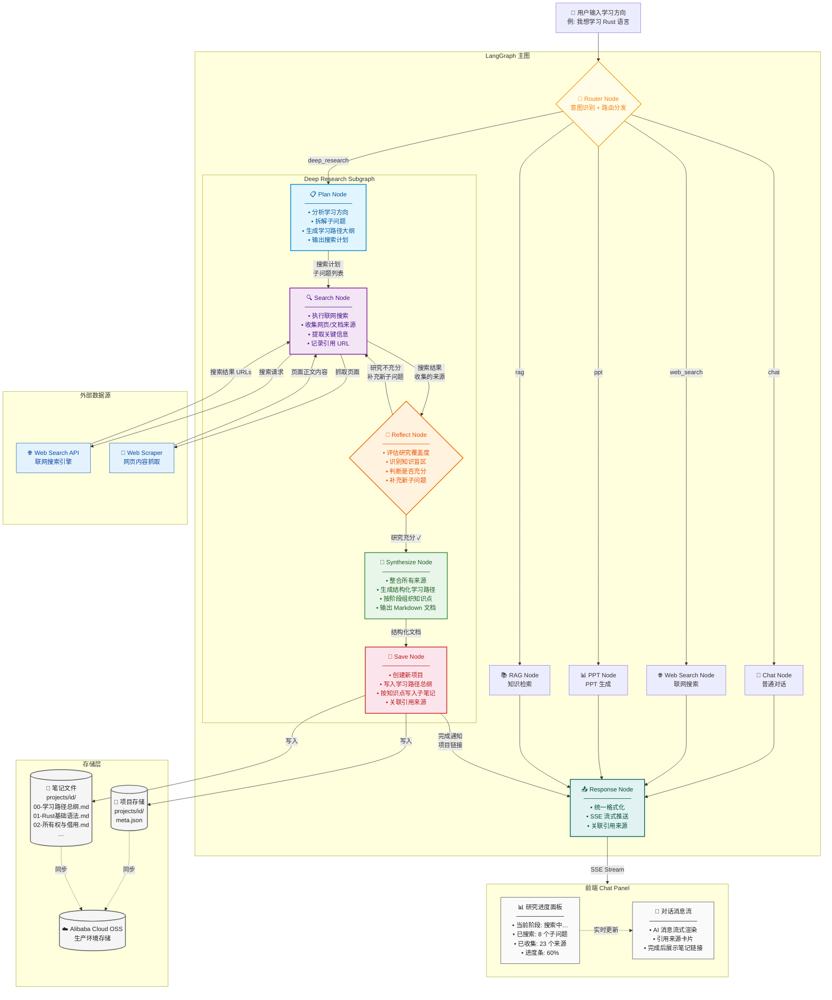

# Deep Research 架构设计

## 整体架构图



## LangGraph State 结构

```typescript
interface DeepResearchState {
  // ─── 输入 ───
  userQuery: string                // 用户输入的学习方向
  projectId?: string               // 关联的项目 ID（可选）

  // ─── Plan 阶段产出 ───
  learningPath: LearningPathItem[]  // 学习路径大纲
  subQuestions: SubQuestion[]       // 拆解出的子问题列表

  // ─── Search 阶段产出 ───
  searchResults: SearchResult[]     // 所有搜索结果
  sources: Source[]                 // 收集的引用来源

  // ─── Reflect 阶段产出 ───
  coverage: number                  // 研究覆盖度 0-1
  knowledgeGaps: string[]           // 识别到的知识盲区
  newSubQuestions: SubQuestion[]    // 补充的新子问题
  isSufficient: boolean             // 研究是否充分

  // ─── Synthesize 阶段产出 ───
  synthesizedDocs: SynthesizedDoc[] // 生成的结构化文档

  // ─── Save 阶段产出 ───
  savedProjectId: string            // 创建的项目 ID
  savedFileCount: number            // 保存的文件数

  // ─── 流式输出 ───
  streaming: {
    currentPhase: 'plan' | 'search' | 'reflect' | 'synthesize' | 'save'
    currentStep: string             // 当前步骤描述
    progress: number                // 总进度 0-100
    log: string[]                   // 研究日志
  }

  // ─── 迭代控制 ───
  iterationCount: number            // 当前搜索轮次
  maxIterations: number             // 最大轮次（默认 5）

  // ─── 对话上下文 ───
  messages: BaseMessage[]           // 完整对话历史
}

interface LearningPathItem {
  stage: string                      // 阶段名称 "基础阶段"
  topics: string[]                   // 该阶段的知识点
  order: number                      // 推荐学习顺序
}

interface SubQuestion {
  id: string
  question: string                   // 子问题
  status: 'pending' | 'searching' | 'done'
  searchResults?: SearchResult[]
}

interface SearchResult {
  url: string
  title: string
  content: string                    // 抓取的正文摘要
  relevanceScore: number
  subQuestionId: string              // 关联的子问题
}

interface Source {
  url: string
  title: string
  type: 'web' | 'doc' | 'tutorial' | 'video'
  citedIn: string[]                  // 在哪些文档中被引用
}

interface SynthesizedDoc {
  filename: string                   // "01-Rust基础语法.md"
  title: string                      // 文档标题
  content: string                    // Markdown 正文
  stage: string                      // 所属学习阶段
  sources: Source[]                  // 引用来源
}
```

## 各节点详细设计

### 1. Router Node

```
输入: { userQuery, messages }
处理:
  - 调用 LLM 做意图分类（轻量 prompt）
  - 输出: chat | web_search | ppt | deep_research | rag
  - deep_research 触发条件:
    - 包含"学习""研究""了解""深入"等关键词
    - 查询长度 > 10 字
    - 明确的学科/技术方向
输出: { intent, userQuery, messages }
```

### 2. Plan Node

```
输入: { userQuery, messages }
处理:
  - System Prompt: 你是一位专业的学习路径规划师
  - 分析用户的学习方向
  - 生成 3-5 个学习阶段
  - 每个阶段拆解 3-5 个子问题
  - 输出结构化的学习路径 + 搜索计划
输出: { learningPath, subQuestions, streaming.progress }
流式推送: "正在规划学习路径… 已生成 4 个学习阶段"
```

### 3. Search Node

```
输入: { subQuestions[pending], iterationCount }
处理:
  - 取出所有 pending 状态的子问题
  - 对每个子问题:
    - 构造搜索 query
    - 调用 Web Search API
    - 对 Top 3 结果抓取正文
    - 提取关键信息，打相关性分
    - 标记为 done
  - 汇总所有搜索结果和来源
输出: { searchResults, sources, streaming.progress }
流式推送: "正在搜索: Rust 所有权机制… 找到 5 篇相关资料"
```

### 4. Reflect Node

```
输入: { subQuestions, searchResults, learningPath, iterationCount, maxIterations }
处理:
  - 评估每个学习阶段的覆盖度
  - 检查是否存在知识盲区
  - 计算 overall coverage score
  - 如果 coverage < 0.7 且 iterationCount < maxIterations:
    - 生成补充子问题
    - 设置 isSufficient = false
  - 否则:
    - 设置 isSufficient = true
输出: { coverage, knowledgeGaps, newSubQuestions, isSufficient }
流式推送: "研究覆盖度: 65%，发现 2 个知识盲区，补充搜索中…"
```

### 5. Synthesize Node

```
输入: { learningPath, searchResults, sources, userQuery }
处理:
  - 按学习路径阶段组织内容
  - 每个阶段生成一篇 Markdown 文档:
    - 知识点讲解
    - 代码示例（如适用）
    - 引用来源链接
    - 推荐进一步阅读
  - 生成一篇总纲文档:
    - 完整学习路径
    - 各阶段概要
    - 学习建议
输出: { synthesizedDocs }
流式推送: "正在整理学习笔记… 已生成 5 篇文档"
```

### 6. Save Node

```
输入: { synthesizedDocs, userQuery, projectId }
处理:
  - 如果没有 projectId:
    - 创建新项目，名称取自 userQuery
  - 写入文件:
    - 00-学习路径总纲.md
    - 01-第一阶段标题.md
    - 02-第二阶段标题.md
    - ...
  - 每个 .md 文件存储到 projects/{id}/
输出: { savedProjectId, savedFileCount }
流式推送: "已创建项目「Rust 语言学习」，保存 6 篇笔记"
```

## API 设计

### 调用方式

```
POST /api/deep-research
Content-Type: application/json

{
  "query": "我想学习 Rust 语言",
  "projectId": "proj-xxx"
}

Response: SSE Stream
```

### SSE 事件类型

```
event: progress
data: {"phase":"plan","step":"正在规划学习路径…","progress":10}

event: progress
data: {"phase":"search","step":"正在搜索: Rust 所有权机制…","progress":35}

event: progress
data: {"phase":"reflect","step":"研究覆盖度: 65%，补充搜索中…","progress":50}

event: progress
data: {"phase":"synthesize","step":"正在整理学习笔记…","progress":75}

event: progress
data: {"phase":"save","step":"保存笔记到项目…","progress":90}

event: complete
data: {"projectId":"proj-xxx","fileCount":6,"message":"研究完成！已创建 6 篇学习笔记"}

event: error
data: {"message":"研究过程中出错","detail":"..."}
```
